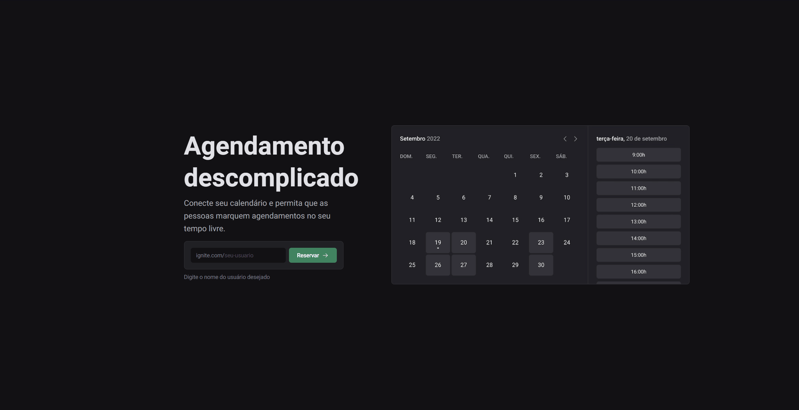

## ℹ️ About

- This project is an application that we can create an account, synchronize this account with our Google account and create appointments through the application's own calendar.
- When a schedule is created by the application, it is mirrored in the synchronized google calendar.
- The most complex component of this project was undoubtedly the Calendar component, where it can be extracted from the project to use in any future projects.
- Throughout this project I went through several technologies, some being changed along the proccess, beacause these changes are needed to put this app in production, but below I will mention them all.

## ⚙️ Technologies
- React.js
- Next.js
- Typescript
- Dayjs
- Phospor React
- Eslint
- Stitches (CSS-in-JS)
- React Query
- Axios
- React Hook Form
- Zod
- Cookies
- OAuth Google
- Google API
- Prisma
- SQLite
- MySQL
- Docker
- Planet Scale
- Vercel

obs: The design system used was that of the rocketseat that we developed in the last module.

To run this project the command is:
```npm i```
```npm run dev```

obs: It is necessary to create an .env file with the necessary environment variables according to your accounts.

obs2: It is also necessary to pay attention to migrations and schema configurations according to the bank you are going to use.


## 🖥 Project Images

